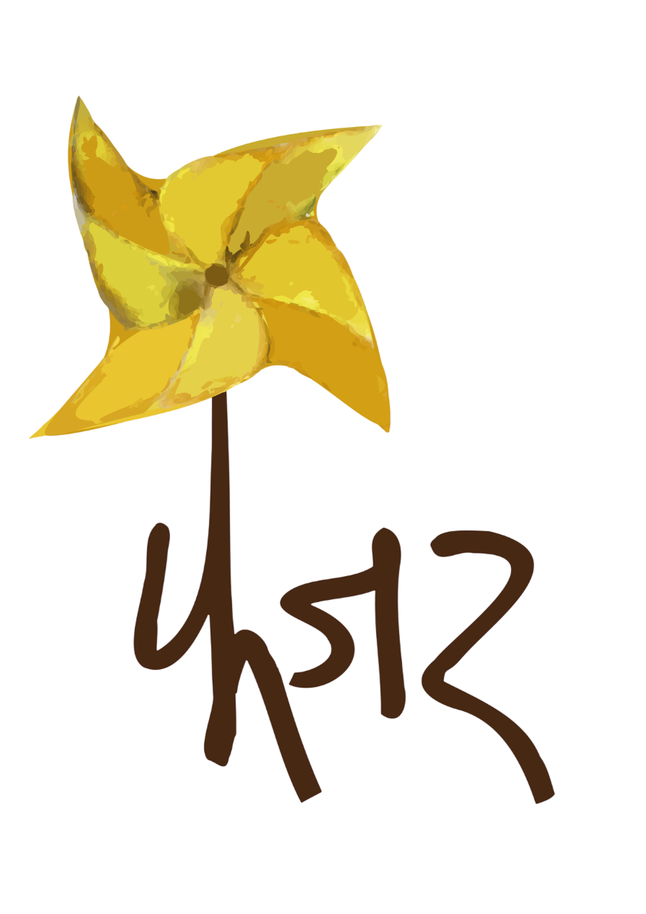
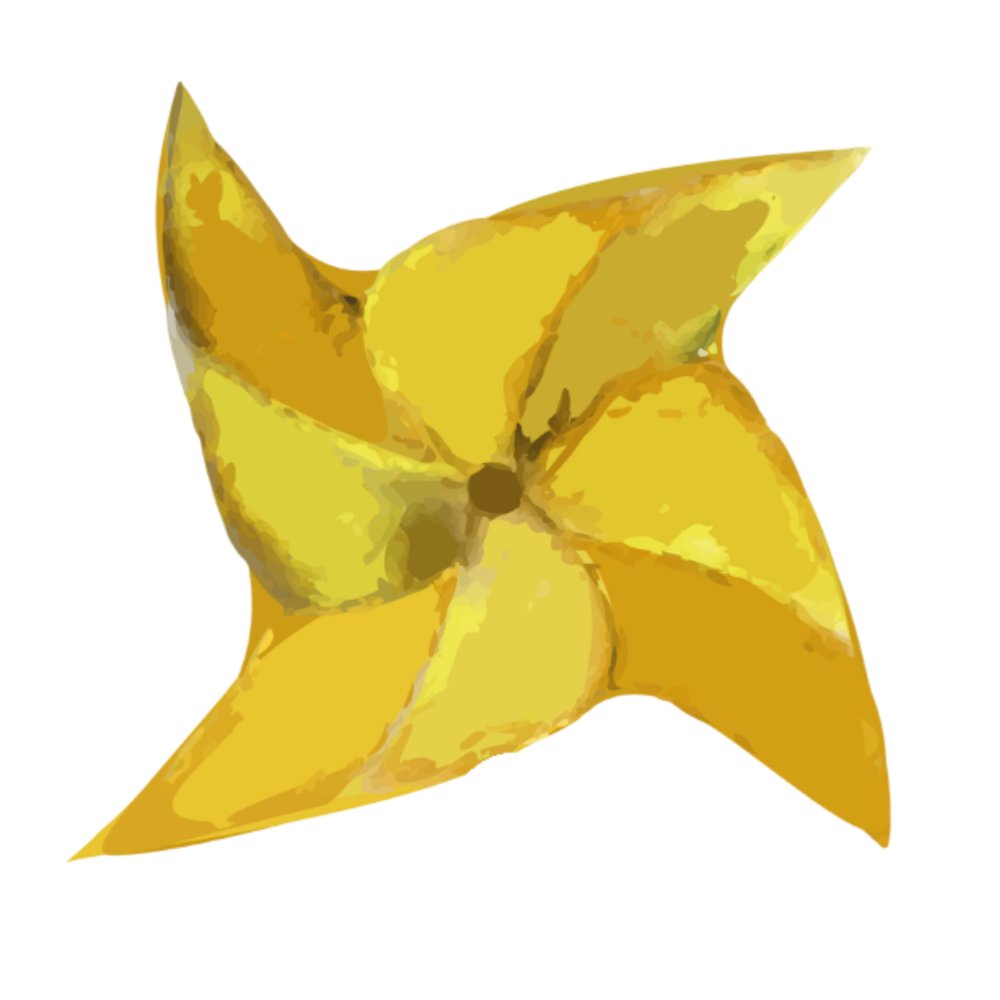

<!DOCTYPE html>
<!--
  ============================================================
  FAJAR FOUNDATION — OFFICIAL WEBSITE
  ============================================================
  File        : index.html
  Description : The complete single-page website for Fajar
                Foundation. Everything — the design (CSS),
                the content (HTML), and the behaviour
                (JavaScript) — lives in this one file.

  HOW THIS FILE IS ORGANISED
  ───────────────────────────
  1. HEAD          → Behind-the-scenes setup (fonts, icons, etc.)
  2. STYLE / CSS   → All visual design rules (colours, sizes,
                     layout, animations). Think of this as the
                     "paint and architecture" of the website.
  3. BODY / HTML   → The actual content visible on the page,
                     built section by section top to bottom.
  4. JAVASCRIPT    → Behaviour: scroll animations, number
                     counters, the popup, and the page loader.

  IMAGES NEEDED (place in the same folder as this file)
  ──────────────────────────────────────────────────────
    logo.png      → Full Fajar Foundation wordmark (used in
                    the top navigation bar and footer)
    ff_logo.png   → Icon-only logo / pinwheel (used in the
                    hero section and the loading spinner)
    hero.jpg      → Background photo for the hero section
    alim.jpg      → Co-founder Alim's photo
    kartik.jpg    → Co-founder Kartik's photo
    nitin.jpg     → Co-founder Nitin's photo

  TO UPDATE CONTENT
  ──────────────────
  Search for the section you want (e.g. <!-- TEAM -->) and
  edit the text between the HTML tags. You do NOT need to
  touch the CSS or JavaScript to change words or images.
  ============================================================
-->
<html lang="en">

<!-- ============================================================
     HEAD SECTION
     Everything inside <head> is not visible on the page.
     It contains instructions the browser needs before
     displaying anything.
     ============================================================ -->
<head>

  <!-- Tells the browser this file uses UTF-8 character encoding
       so special characters (like — or ") display correctly. -->
  <meta charset="UTF-8" />

  <!-- Makes the website look correct on mobile phones and tablets.
       Without this, mobiles would zoom out and show a tiny version. -->
  <meta name="viewport" content="width=device-width, initial-scale=1.0"/>

  <!-- The text that appears on the browser tab -->
  <title>Fajar Foundation</title>

  <!-- These two lines speed up loading of Google Fonts by
       opening a connection to Google's servers early. -->
  <link rel="preconnect" href="https://fonts.googleapis.com"/>
  <link rel="preconnect" href="https://fonts.gstatic.com" crossorigin/>

  <!-- Loads two fonts from Google:
       • Cormorant Garamond → elegant serif font used for
         headings and display text (gives the premium feel)
       • Jost → clean sans-serif font used for body text,
         labels, and navigation links -->
  <link href="https://fonts.googleapis.com/css2?family=Cormorant+Garamond:ital,wght@0,400;0,500;0,600;0,700;1,400;1,600&family=Jost:wght@300;400;500;600&display=swap" rel="stylesheet"/>

  <!-- Loads Font Awesome — a library of icons.
       We use it for the LinkedIn and Instagram icons in the footer. -->
  <link rel="stylesheet" href="https://cdnjs.cloudflare.com/ajax/libs/font-awesome/6.5.0/css/all.min.css"/>

  <!-- ============================================================
       STYLE SECTION (CSS — THE DESIGN)
       CSS = Cascading Style Sheets. These are rules that tell
       the browser how everything should look: colours, sizes,
       spacing, fonts, animations, and layout.

       How to read a CSS rule:
         selector { property: value; }
       Example:
         h1 { color: red; font-size: 32px; }
         This means: "make every h1 heading red and 32px tall."
       ============================================================ -->
  
</head>

<!-- ============================================================
     BODY SECTION — THE VISIBLE CONTENT
     Everything between <body> and </body> is what visitors see.
     Sections are ordered top to bottom as they appear on the page.
     ============================================================ -->
<body>

  <!-- ─────────────────────────────────────────────────────────
       PAGE LOADER
       This full-screen overlay is visible when the page first
       loads. It shows the spinning ff_logo.png icon for 1.2
       seconds, then fades out. Controlled by the JavaScript
       at the bottom of this file.
       ───────────────────────────────────────────────────────── -->
  

    <!-- ff_logo.png = the icon/pinwheel logo (not the full wordmark)
         It spins because of the @keyframes spinLoader rule in CSS above -->
    
  

  <!-- ─────────────────────────────────────────────────────────
       NAVIGATION BAR
       Fixed at the top of the screen at all times.
       Contains: logo on the left, page links on the right.

       HOW TO UPDATE THE NAV:
       • To change the logo → replace logo.png in the folder
       • To add a new page link → copy a <li><a> block and
         update the href="#section-id" and link text
       ───────────────────────────────────────────────────────── -->
  <nav>

    <!-- Logo: clicking it scrolls back to the top (home) -->
    

    <!-- Navigation links: each href="#id" scrolls to that section -->
    <ul class="nav-links">
      <li><a href="#home">HOME</a></li>
      <li><a href="#about">ABOUT</a></li>
      <li><a href="#programs">PROGRAMS</a></li>
      <li><a href="#team">TEAM</a></li>
      <li><a href="#donate">DONATE</a></li>
      <li><a href="#contact">CONTACT</a></li>

      <!-- "GET INVOLVED" is a button (not a link) — it opens the
           internship popup. onclick="openInvolved()" calls the
           JavaScript function defined at the bottom of this file. -->
      <li>
        <button class="nav-involved-btn" onclick="openInvolved()">
          GET INVOLVED
        </button>
      </li>
    </ul>

  </nav>

  <!-- ─────────────────────────────────────────────────────────
       SECTION 1: HERO
       The first screen visitors see. Full-height, background
       image on the right, text content on the left.

       HOW TO UPDATE:
       • Change headline → edit the <h1> text
       • Change background photo → replace hero.jpg in the folder
       • Change the decorative logo → replace ff_logo.png
       • Change the button destination → edit href="#about"
       ───────────────────────────────────────────────────────── -->
  <section id="home">

    <!-- Background image layer — styled in CSS (.hero-bg) -->
    

    <!-- Text content — fades in on page load via the "reveal" class -->
    

      <!-- Small gold tag above the headline -->
      
A Movement. A Dawn. A New Era.

      <!-- Main headline — "movement" is underlined in gold -->
      <h1 class="hero-title">
        More than an organisation — 
        FAJAR is a movement
      </h1>

      <!-- Supporting paragraph -->
      

        A collective of young professionals committed to those whom the world
        has overlooked or pushed to the margins. Rooted in the heart of
        <strong>rural India</strong>, we believe that community-led leadership
        can replace systemic dependency — one dawn at a time.
      

      <!-- Call-to-action button — scrolls to the About section -->
      <a href="#about" class="hero-cta">DISCOVER OUR STORY →</a>

    

    <!-- Decorative logo positioned on the right side of the hero.
         Full opacity — shown as a real logo, not a background watermark.
         TO RESIZE: change width in the CSS .hero-deco img rule. -->
    

      
    

  </section>

  <!-- ─────────────────────────────────────────────────────────
       SECTION 2: ABOUT FAJAR
       Dark brown background. Tells the foundation's story —
       what it is, when it was founded, and what it stands for.

       HOW TO UPDATE: Edit the text inside the 
 tags.
       ───────────────────────────────────────────────────────── -->
  <section id="about" class="reveal">

    <!-- Section eyebrow label: "— ABOUT FAJAR —" -->
    
ABOUT FAJAR

    <!-- Section heading -->
    <h2 class="about-title">The Dawn of Transformation</h2>

    <!-- First paragraph — Foundation's legal background -->
    

      FAJAR Foundation, established in 2024 and
      registered under Section 8 of the Companies Act,
      2013, is a non-profit organization deeply rooted in the heart of
      rural India.
    

    <!-- Second paragraph — the movement framing -->
    

      More than just an organization, FAJAR is a
      movement — a collective of young
      professionals committed to those whom the world has overlooked or pushed
      to the margins.
    

    <!-- The pill-shaped badge at the bottom -->
    

      "Fajar" means Dawn — the beginning of a new era
    

  </section>

  <!-- ─────────────────────────────────────────────────────────
       SECTION 3: CORE BELIEF
       Two-column layout. Left: the "Justice" statement.
       Right: three value cards — Social, Economic, Political.

       HOW TO UPDATE:
       • Edit the left-side text directly in the 
 tags
       • To change belief card content → find .belief-card in HTML
         and update the icon emoji, title, and body text
       ───────────────────────────────────────────────────────── -->
  <section id="belief">

    <!-- LEFT COLUMN: the big statement and explanation -->
    

      <!-- Eyebrow: "OUR CORE BELIEF" -->
      
OUR CORE BELIEF

      <!-- The bold statement -->
      <h2 class="belief-title">
        Justice is not an Ideal. It is a Practical Necessity.
      </h2>

      <!-- Explanation paragraph -->
      

        We believe that a thriving community is built upon the pillars of
        social, economic, and political
        JUSTICE. For us,
        <strong>SOCIAL EQUITY</strong> is a practical necessity for millions
        of underprivileged sections — not a distant aspiration, but an urgent
        and actionable commitment we pursue every single day.
      

    

    <!-- RIGHT COLUMN: the three value cards -->
    

      <!-- Card 1: Social -->
      

        ⚖️
        
SOCIAL

        

          Equity and dignity for every individual regardless of background.
        

      

      <!-- Card 2: Economic -->
      

        📈
        
ECONOMIC

        

          Opportunities and self-reliance for marginalized communities.
        

      

      <!-- Card 3: Political -->
      

        🗣️
        
POLITICAL

        

          Voice, representation, and leadership from within communities.
        

      

    

  </section>

  <!-- ─────────────────────────────────────────────────────────
       SECTION 4: OUR APPROACH
       Explains the two strategic pillars: Education and Youth.
       Each pillar gets its own card with an icon, number, and text.
       ───────────────────────────────────────────────────────── -->
  <section id="approach">

    <!-- Section header block: eyebrow + heading + subtitle -->
    

      
OUR APPROACH

      <h2 class="approach-title">How We Create Change</h2>
      

        Our work rests on two powerful convictions — that education is
        transformative, and that the best solutions come from within the
        community.
      

    

    <!-- Two-column grid of approach cards -->
    

      <!-- Card 01: Education as a Pathway -->
      

        

          <!-- SVG icon: an open book -->
          

            <svg viewBox="0 0 24 24" fill="none">
              <path d="M4 19.5A2.5 2.5 0 0 1 6.5 17H20"
                stroke="#e8c060" stroke-width="2" stroke-linecap="round"/>
              <path d="M6.5 2H20v20H6.5A2.5 2.5 0 0 1 4 19.5v-15A2.5 2.5 0 0 1 6.5 2z"
                stroke="#e8c060" stroke-width="2"/>
            </svg>
          

          <!-- Large pale number in top-right corner of the card -->
          01

        

        <h3 class="approach-card-title">Education as a Pathway</h3>
        

          Our conviction is unwavering: the light of
          quality education is the primary force
          capable of breaking the generational cycle of marginalization. We
          define education far beyond the walls of a classroom — it is the
          process of <strong>capacitating minds</strong>, the bridge to a
          future where individuals possess the agency of informed decisions.
        

      

      <!-- Card 02: Youth as a Catalyst of Change -->
      

        

          <!-- SVG icon: a lightning bolt -->
          

            <svg viewBox="0 0 24 24" fill="none">
              <path d="M13 2L3 14h9l-1 8 10-12h-9l1-8z"
                stroke="#e8c060" stroke-width="2" stroke-linejoin="round"/>
            </svg>
          

          02

        

        <h3 class="approach-card-title">Youth as a Catalyst of Change</h3>
        

          We believe in solutions that come from the ground. We position
          <strong>rural youth</strong> as the primary catalysts of change —
          capacitating young minds with professional skills and the confidence
          to lead, fostering a new
          <strong>leadership and self-reliance</strong> cultivated from within
          the underprivileged community itself.
        

      

    

  </section>

  <!-- ─────────────────────────────────────────────────────────
       QUOTE BANNER
       Full-width dark brown section with the organisation's
       signature quote in large italic serif text.

       HOW TO UPDATE: Edit the text inside .quote-text
       ───────────────────────────────────────────────────────── -->
  <section id="quote" class="reveal">

    <!-- Decorative large opening quotation mark -->
    "

    <!-- The quote text — "PEOPLE" is highlighted in gold -->
    

      At FAJAR, we aren't just envisioning a better future — we are building
      it alongside the PEOPLE who will lead it.
    

    <!-- Attribution line -->
    
— Fajar Foundation, Est. 2024

  </section>

  <!-- ─────────────────────────────────────────────────────────
       SECTION 5: PROGRAMS
       Three cards summarising the foundation's programs.

       HOW TO UPDATE:
       • Change program name → edit .prog-card-title
       • Change description → edit .prog-card-body
       • Change icon → replace the emoji in .prog-card-icon
       ───────────────────────────────────────────────────────── -->
  <section id="programs">

    
OUR PROGRAMS

    <h2 class="programs-title reveal">Initiatives for Impact</h2>
    

      From rural classrooms to community leadership — our programs are designed
      to ignite change from within.
    

    <!-- Three program cards in a grid -->
    

      <!-- Program 1 -->
      

        
📚

        <h3 class="prog-card-title">Educational Outreach</h3>
        

          Quality learning support for children in underserved rural areas,
          building foundational skills and a love for learning.
        

      

      <!-- Program 2 -->
      

        
💡

        <h3 class="prog-card-title">Youth Leadership</h3>
        

          Developing confident, capable young leaders who can advocate for and
          serve their own communities.
        

      

      <!-- Program 3 -->
      

        
🤝

        <h3 class="prog-card-title">Community Capacitation</h3>
        

          Skill development and livelihood programs that create economic
          self-reliance at the grassroots level.
        

      

    

  </section>

  <!-- ─────────────────────────────────────────────────────────
       SECTION 6: IMPACT
       Four animated number cards that count up from 0 when the
       visitor scrolls down to this section.

       HOW TO UPDATE NUMBERS:
       Change data-target="1000" to any number you want.
       The counter will automatically animate up to that number.

       Example: data-target="2500" → counts up to 2,500
       ───────────────────────────────────────────────────────── -->
  <section id="impact">

    
OUR IMPACT

    <h2 class="impact-title reveal">Numbers that Tell Our Story</h2>
    

      Every number reflects a life touched, a future shaped, and a community
      strengthened.
    

    <!-- Four impact number cards -->
    

      <!-- Each .impact-number starts at "0" and counts up to data-target
           when this section is scrolled into view (handled by JavaScript) -->

      

        0
        
Students Reached

      

      

        0
        
Schools Engaged

      

      

        0
        
Districts Covered

      

      

        0
        
Community Members Supported

      

    

  </section>

  <!-- ─────────────────────────────────────────────────────────
       SECTION 7: TEAM
       Three co-founder profile cards. Each card has:
       a photo, a "Co-Founder" badge, a name, and a biography.

       HOW TO UPDATE:
       • Photo → replace alim.jpg / kartik.jpg / nitin.jpg in folder
       • Name → edit the <h3 class="team-name"> text
       • Biography → edit the 
 tags inside .team-bio
       ───────────────────────────────────────────────────────── -->
  <section id="team">

    
THE PEOPLE BEHIND FAJAR

    <h2 class="team-title reveal">Our Team</h2>
    

      A collective of passionate young professionals committed to building a
      more just and equitable India — one community at a time.
    

    <!-- Three team member cards -->
    

      <!-- ── TEAM MEMBER 1: ALIM ── -->
      

        <!-- Photo: replace alim.jpg with a new file of the same name to update -->
        

          
        

        <!-- Name, badge, and biography -->
        

          Co-Founder
          <h3 class="team-name">Alim</h3>
          

            

              Alim Shaikh is a development professional with 7+ years of
              experience in education, youth development, and public systems.
              A Gandhi Fellowship alumnus, he has worked closely with
              governments and communities to improve learning outcomes and
              strengthen program implementation.
            

            

              Coming from a rural school background, he is deeply committed to
              creating equitable opportunities for young people. At Fajar
              Foundation, he focuses on building scalable solutions that
              empower students and strengthen local education systems.
            

          

        

        <!-- Decorative gold gradient bar at the bottom of the card -->
        

      

      <!-- ── TEAM MEMBER 2: KARTIK ── -->
      

        

          
        

        

          Co-Founder
          <h3 class="team-name">Kartik</h3>
          

            

              Kartik brings over a decade of experience in the development
              sector, with a strong focus on rural communities. His journey
              began in Melghat, shaping his commitment to social impact.
            

            

              He has worked extensively in Chhattisgarh on livelihoods,
              gender, and youth development. Kartik is also passionate about
              mentoring rural students to access higher education, and at
              Fajar, he works on creating pathways for youth empowerment.
            

          

        

        

      

      <!-- ── TEAM MEMBER 3: NITIN ── -->
      

        

          
        

        

          Co-Founder
          <h3 class="team-name">Nitin</h3>
          

            

              Nitin is a development practitioner with 4+ years of experience
              working in tribal regions of central India. His work focuses on
              climate resilience, rural governance, and strengthening
              grassroots institutions.
            

            

              He has supported women farmers and community groups in building
              sustainable livelihoods and accessing social protection. At
              Fajar, he brings a strong field perspective to drive
              community-led development initiatives.
            

          

        

        

      

    

  </section>

  <!-- ─────────────────────────────────────────────────────────
       SECTION 8: DONATE
       A warm brown call-to-action section. Currently the
       "DONATE NOW" button links to the Contact section.

       HOW TO UPDATE:
       • To link to a payment page → change href="#contact" to
         your actual payment or donation URL
       ───────────────────────────────────────────────────────── -->
  <section id="donate" class="reveal">

    
SUPPORT THE CAUSE

    <h2 class="donate-title">Be Part of the Dawn</h2>
    

      Every contribution helps us reach further into the margins — supporting
      education, building leaders, and changing lives one community at a time.
    

    <!-- Currently links to the Contact section. Replace with a donation URL when ready. -->
    <a href="#contact" class="donate-btn">DONATE NOW →</a>

  </section>

  <!-- ─────────────────────────────────────────────────────────
       SECTION 9: CONTACT
       A contact form with fields for Name, Email, Subject,
       and Message. The form currently does nothing on submit
       (onsubmit="return false;") — it needs to be connected
       to a backend service (like Formspree or EmailJS) to
       actually send emails.

       HOW TO MAKE THE FORM WORK:
       Sign up at https://formspree.io, get a form action URL,
       then replace onsubmit="return false;" with
       action="https://formspree.io/f/YOUR_ID" method="POST"
       ───────────────────────────────────────────────────────── -->
  <section id="contact">

    
GET IN TOUCH

    <h2 class="contact-title reveal">Contact Us</h2>
    

      Have a question, a partnership idea, or want to volunteer? We'd love to
      hear from you.
    

    <!-- Contact form — currently non-functional (no backend connected) -->
    <form class="contact-form reveal" onsubmit="return false;">
      <input type="text"  placeholder="Your Name"/>
      <input type="email" placeholder="Your Email"/>
      <input type="text"  placeholder="Subject"/>
      <textarea           placeholder="Your Message"></textarea>
      <button type="submit" class="contact-submit">SEND MESSAGE →</button>
    </form>

  </section>

  <!-- ─────────────────────────────────────────────────────────
       FOOTER
       Dark brown footer with the logo, registered address
       on the left, and social media icons + copyright on
       the right.

       HOW TO UPDATE:
       • Address → edit the text inside .footer-address
       • Social links → replace href="#" with actual profile URLs
       ───────────────────────────────────────────────────────── -->
  <footer>

    <!-- LEFT: Logo and registered address -->
    

      

        <!-- logo.png = the full Fajar Foundation wordmark -->
        
      

      

        FAJAR FOUNDATION 
        C/O Avinash Ramrao Chitrakar, 
        At Tawlar, Pathrot, 
        Achalpur City, Amravati – 444808, 
        Maharashtra
      

    

    <!-- RIGHT: Social icons and copyright notice -->
    

      

        <!-- LinkedIn icon — replace href="#" with your LinkedIn page URL -->
        <a href="#" target="_blank" class="social-icon" aria-label="LinkedIn">
          <i class="fab fa-linkedin-in"></i>
        </a>
        <!-- Instagram icon — replace href="#" with your Instagram profile URL -->
        <a href="#" target="_blank" class="social-icon" aria-label="Instagram">
          <i class="fab fa-instagram"></i>
        </a>
      

      

        © 2024 Fajar Foundation. 
        Registered under Section 8, Companies Act 2013.
      

    

  </footer>

  <!-- ─────────────────────────────────────────────────────────
       GET INVOLVED POPUP (MODAL)
       Hidden by default. Opens when the user clicks the
       "GET INVOLVED" button in the navigation bar.
       Shows three internship opportunities and an "APPLY NOW"
       button that links to a Google Form.

       HOW TO UPDATE:
       • Add/remove internship roles → copy or delete .involved-item blocks
       • Change the Google Form link → find the href below and
         replace the URL with your new form link
       ───────────────────────────────────────────────────────── -->
  

    <!-- The actual popup box (child of the dark overlay) -->
    

      <!-- × close button: calls closeInvolved() in JavaScript -->
      <button class="close-btn" onclick="closeInvolved()" aria-label="Close">
        ×
      </button>

      <h2>Work With Us</h2>
      
Join us in building change from the ground up.

      <!-- List of internship opportunities -->
      

        <!-- Internship 1 -->
        

          <h3>Social Media &amp; Communications Intern</h3>
          

            Create content, manage social media, and help us tell impactful
            stories. 
            <strong>Duration:</strong> 3 months
          

        

        <!-- Internship 2 -->
        

          <h3>Fundraising &amp; Partnerships Intern</h3>
          

            Support fundraising strategy, donor outreach, and partnerships. 
            <strong>Duration:</strong> 3 months
          

        

        <!-- Internship 3 -->
        

          <h3>Field Research Intern</h3>
          

            Work with communities, collect field data, and support program
            insights. 
            <strong>Duration:</strong> 2–3 months
          

        

      

      <!-- "APPLY NOW" button — links to the Google Form application -->
      <!-- TO UPDATE: replace the href URL with your new form link -->
      <a href="https://forms.gle/2pZhjgX8KpmhEt1s8"
         target="_blank"
         rel="noopener noreferrer"
         class="apply-main-btn">
        APPLY NOW →
      </a>

    

  

  <!-- ============================================================
       JAVASCRIPT — BEHAVIOUR & INTERACTIVITY
       JavaScript makes the page interactive. This block handles:

       1. SCROLL REVEAL     → Elements fade in as you scroll down
       2. IMPACT COUNTERS   → Numbers count up when you reach
                              the Impact section
       3. GET INVOLVED POPUP → Opens and closes the popup window
       4. PAGE LOADER       → Fades out the loading screen after
                              1.2 seconds

       None of this affects what the page looks like — only how
       it behaves. You can edit text and images without touching
       any of this JavaScript.
       ============================================================ -->
  

</body>
</html>
